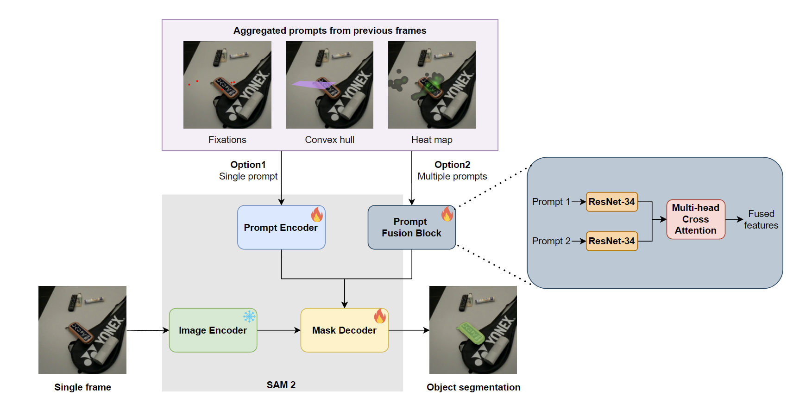

<h4 align="center">
  PyTorch implementation for
</h4>

<h3 align="center">
Leveraging Temporal Gaze Patterns  <br> for Intelligent Segmentation in Mobile Eye-Tracking - <a href="https://etra.acm.org/2025/">ETRA2025</a>
</h3>
<h4 align="center">
SHUPENG WANG∗, YIZI CHEN∗, SIDI WU, PETER KIEFER, MARTIN RAUBAL <br>
ETH Zürich
</h4>

<p align="center">

</p>

## Abstract
Recent advancements in deep learning models for object segmentation have significantly enhanced the analysis of mobile eye-tracking data, enabling automatic dataset annotation. However, many of these models rely solely on raw gaze and fixation points to indicate annotation targets on individual video frames, thereby neglecting the valuable temporal contexts provided by gaze features. In this paper, we introduce a pipeline that integrates temporal gaze features into the SAM 2 model to improve the segmentation accuracy of automatic annotations for mobile eye-tracking data. Specifically, we investigate different types of encoding temporal gaze information, used as prompts, to help the model learn gaze patterns at various levels of object granularity and to account for inaccuracies in gaze location introduced by mobile scenarios. Our experiments show that adding temporal context largely benefits the segmentation performance. In addition, our proposed fusion strategy allows us to combine different types of prompts and shows promising results.

## Repository Structure

```
Gaze_seg/
├── train/          # Training code for Gaze-seg
├── test/           # Testing code for Gaze-seg
├── checkpoints/    # Pre-trained checkpoints 
├── README.md       # Project documentation (this file)
├── img/            # Example image
```

## Getting Started

1. Clone the repository:
    ```bash
    git clone https://github.com/SpWang33/Gaze-Seg
    ```
2. Install dependencies:
    ```bash
    # Install packages 
    pip install numpy tqdm pillow matplotlib datetime

    # Install pytorch (need to match your cuda version)
    pip install torch torchvision torchaudio --index-url https://download.pytorch.org/whl/cu118

    # Install samv2
    git clone https://github.com/facebookresearch/sam2.git && cd sam2
    pip install -e .

    ```
3. Download the pre-trained weights:
    ```
    cd checkpoints && \
    ./download_ckpts.sh && \
    cd ..
    ```

4. Training, exp represents the experiment number in the paper:
    ```
    python train/trian_{exp}.py
    ```

5. Testing, exp represents the expeirment number in the paper:
    ```
    python test/test_{exp}.py
    ```

## Data
Release of the dataset is forthcoming.

## License

This project is licensed under the MIT License.

## Citations

If you find this code useful in your research, please cite our [paper](https://dl.acm.org/doi/pdf/10.1145/3729412):

```
@article{10.1145/3729412,
author = {Wang, Shupeng and Chen, Yizi and Wu, Sidi and Kiefer, Peter and Raubal, Martin},
title = {Leveraging Temporal Gaze Patterns for Intelligent Segmentation in Mobile Eye-Tracking},
year = {2025},
issue_date = {June 2025},
publisher = {Association for Computing Machinery},
address = {New York, NY, USA},
volume = {8},
number = {2},
url = {https://doi.org/10.1145/3729412},
doi = {10.1145/3729412},
abstract = {Recent advancements in deep learning models for object segmentation have significantly enhanced the analysis of mobile eye-tracking data, enabling automatic dataset annotation. However, many of these models rely solely on raw gaze and fixation points to indicate annotation targets on individual video frames, thereby neglecting the valuable temporal contexts provided by gaze features. In this paper, we introduce a pipeline that integrates temporal gaze features into the SAM 2 model to improve the segmentation accuracy of automatic annotations for mobile eye-tracking data. Specifically, we investigate different types of encoding temporal gaze information, used as prompts, to help the model learn gaze patterns at various levels of object granularity and to account for inaccuracies in gaze location introduced by mobile scenarios. Our experiments show that adding temporal context largely benefits the segmentation performance. In addition, our proposed fusion strategy allows us to combine different types of prompts and shows promising results.},
journal = {Proc. ACM Comput. Graph. Interact. Tech.},
month = may,
articleno = {26},
numpages = {17},
keywords = {Mobile eye-tracking, Gaze feature, Segmentation, Segment Anything Model 2, Prompt engineering}
}
```

## Acknowledgement
The project 'Digital Twin & VR-Training für höhere Trainingseffizienz bei geringerer Umweltbelastung im Luftverkehr - D-CEET' (Digital Twin & VR Cabin Emergency Evacuation Trainer for higher training efficiency with lower environmental impact in the context of air traffic) is funded by the German Federal Ministry for Digital and Transport through the innovation initiative mFund.